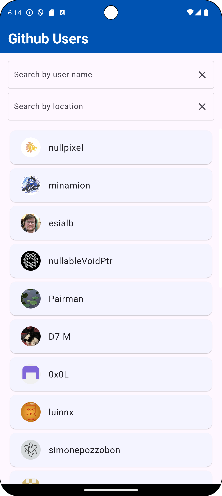
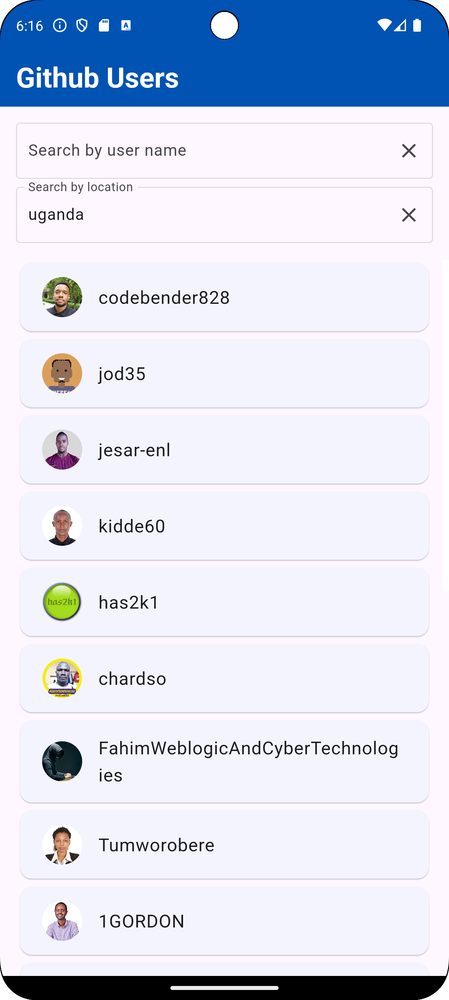

# GitHub Users App
A Flutter application that displays users all over the world and allows users to search for and view details of GitHub users.

## Introduction
The GitHub Users App is designed to provide a simple and efficient way to search for GitHub users by username or location. It retrieves user data from the GitHub API and displays it in a user-friendly manner. The application demonstrates state management with the use of providers. It is structured following Clean Architecture principles to ensure maintainability and scalability.

## Features
- Search Functionality: Search for GitHub users by username or location.
- User Details: View detailed information about a specific user.
- Internet Connectivity Handling: Detect and handle changes in internet connectivity, with prompts to guide users when offline.
- Clean Architecture Implementation: Structured codebase for better maintainability and scalability.
- Infinite scroll pagination: Scroll through github users as it retrieves more.
- Share user profile: Share the user profile link to other social media apps.

## Getting Started
Follow the instructions below to set up and run the project locally.

### Prerequisites

- Flutter SDK
- Android Studio or VSCode
- Fast machine

### Installation

1. Clone the repository:
   ```sh
   git clone https://github.com/jcmugabi/GithubUsersApp.git
   ```
2. Navigate to the project directory:
   ```sh
   cd your-repo
   ```
3. Install dependencies:
   ```sh
   flutter pub get
   ```
   
### Running the App
Instructions on how to run the app on an emulator or a physical device:

1. Run the app:
   ```sh
   flutter run
   ```
   
## Usage
- Diplaying github users all over the globe
- Search: Use the search fields to find GitHub users by username or location.
- View Details: Tap on a user to view their details.
- Internet Connectivity: If there is no internet connection, a dialog will appear prompting you to turn on your internet connection.

## Screenshots







## Contributing
Guidelines for contributing to the project:

1. Fork the repository
2. Create your feature branch (git checkout -b feat_amazing_feature)
3. Commit your changes (git commit -m 'feat(amazing_feature):Add some amazing feature')
4. Push to the branch (git push origin feat_amazing_feature)
5. Open a pull request

## Contact
Email: josephcharlesmugabi@gmail.com
GitHub: jcmugabi
Twitter: @_mugabi_
